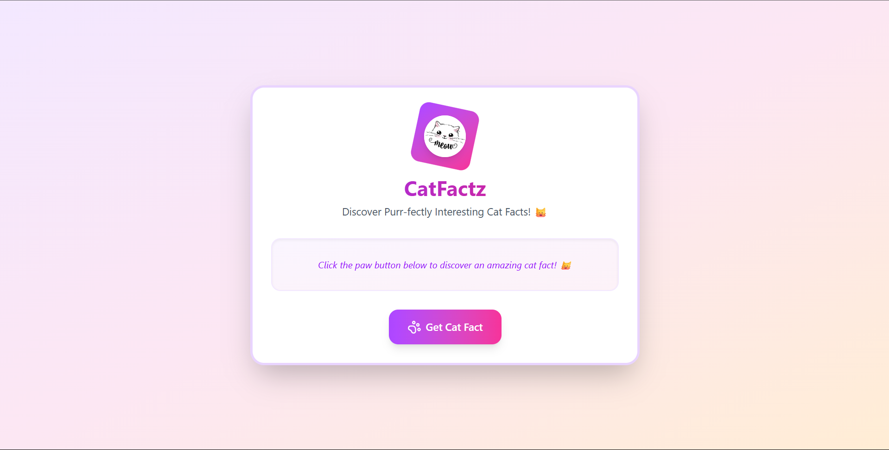

# 🐾 CatFactz

**CatFactz** is a fun and beautifully styled React-based web application that fetches random cat facts from an external API. Built as part of an internship selection assignment, it features delightful UI/UX, responsive design, and a touch of celebratory confetti to enhance user engagement.

---

## 🌟 Features

- 🎉 **Confetti animation** on every new fact
- 🐱 Fetches real-time cat facts using the [`catfact.ninja`](https://catfact.ninja/fact) API
- 💅 Polished and responsive UI with Tailwind CSS
- 🧩 Modular component structure for scalability
- ⚙️ Handles loading and error states gracefully

---

## 📸 Demo

---

## 🚀 Tech Stack

| Tech       | Purpose                             |
|------------|-------------------------------------|
| React.js   | UI Library                          |
| Tailwind CSS | Styling & Responsive Design        |
| Axios      | API Data Fetching                   |
| canvas-confetti | Visual animation on success     |
| Lucide Icons | UI Icon for Paw Button             |

---

## 🎯 Usage

- Click the "Get Cat Fact" button.
- Wait for a second — enjoy the bounce animation and confetti.
- Learn something new about cats!
- If something goes wrong, a friendly error message will appear.

## 💡 Learnings
- Handling asynchronous operations with async/await
- Managing UI state with React Hooks
- Enhancing UX with animations and transitions
- Component-driven development
- Clean error handling and feedback loops

## 🧑‍💻 Author

**Name:** *Sumit Singh*  
**Project Type:** *Internship Assignment*  
**Submission For:** *Yogotribe*  

